```python
%pylab inline
import pandas
import seaborn
```

    Populating the interactive namespace from numpy and matplotlib
    

# LOAD CSV FILE INTO MEMORY


```python
data = pandas.read_csv('uber-raw-data-apr14.csv')
```


```python
data.tail() #last 5 entries
```


<div>
<style scoped>
    .dataframe tbody tr th:only-of-type {
        vertical-align: middle;
    }

    .dataframe tbody tr th {
        vertical-align: top;
    }

    .dataframe thead th {
        text-align: right;
    }
</style>
<table border="1" class="dataframe">
  <thead>
    <tr style="text-align: right;">
      <th></th>
      <th>Date/Time</th>
      <th>Lat</th>
      <th>Lon</th>
      <th>Base</th>
    </tr>
  </thead>
  <tbody>
    <tr>
      <th>564511</th>
      <td>4/30/2014 23:22:00</td>
      <td>40.7640</td>
      <td>-73.9744</td>
      <td>B02764</td>
    </tr>
    <tr>
      <th>564512</th>
      <td>4/30/2014 23:26:00</td>
      <td>40.7629</td>
      <td>-73.9672</td>
      <td>B02764</td>
    </tr>
    <tr>
      <th>564513</th>
      <td>4/30/2014 23:31:00</td>
      <td>40.7443</td>
      <td>-73.9889</td>
      <td>B02764</td>
    </tr>
    <tr>
      <th>564514</th>
      <td>4/30/2014 23:32:00</td>
      <td>40.6756</td>
      <td>-73.9405</td>
      <td>B02764</td>
    </tr>
    <tr>
      <th>564515</th>
      <td>4/30/2014 23:48:00</td>
      <td>40.6880</td>
      <td>-73.9608</td>
      <td>B02764</td>
    </tr>
  </tbody>
</table>
</div>


```python
dt = '4/30/2014 23:22:00'
```


```python
dt.split(' ')
```


    ['4/30/2014', '23:22:00']


```python
d,t = dt.split(' ')
print(d)
print(t)
```

    4/30/2014
    23:22:00
    


```python
m,d,y = d.split('/')
print(m)
print(d)
print(y)
```

    4
    30
    2014
    


```python
#the individual elements are strings and not integers
d
```


    '30'


```python
int(d)
```


    30


#### Effecient way of doing the above


```python
dt = pandas.to_datetime(dt)
dt
#format changes to timestamp -> year-month-date
```


    Timestamp('2014-04-30 23:22:00')


```python
print(dt.day)
print(dt.month)
print(dt.year)
```

    30
    4
    2014
    

## Converting Date/Time column data to pandas datetime format


```python
data['Date/Time'] = data['Date/Time'].map(pandas.to_datetime)
```


```python
data.head()
```


<div>
<style scoped>
    .dataframe tbody tr th:only-of-type {
        vertical-align: middle;
    }

    .dataframe tbody tr th {
        vertical-align: top;
    }

    .dataframe thead th {
        text-align: right;
    }
</style>
<table border="1" class="dataframe">
  <thead>
    <tr style="text-align: right;">
      <th></th>
      <th>Date/Time</th>
      <th>Lat</th>
      <th>Lon</th>
      <th>Base</th>
    </tr>
  </thead>
  <tbody>
    <tr>
      <th>0</th>
      <td>2014-04-01 00:11:00</td>
      <td>40.7690</td>
      <td>-73.9549</td>
      <td>B02512</td>
    </tr>
    <tr>
      <th>1</th>
      <td>2014-04-01 00:17:00</td>
      <td>40.7267</td>
      <td>-74.0345</td>
      <td>B02512</td>
    </tr>
    <tr>
      <th>2</th>
      <td>2014-04-01 00:21:00</td>
      <td>40.7316</td>
      <td>-73.9873</td>
      <td>B02512</td>
    </tr>
    <tr>
      <th>3</th>
      <td>2014-04-01 00:28:00</td>
      <td>40.7588</td>
      <td>-73.9776</td>
      <td>B02512</td>
    </tr>
    <tr>
      <th>4</th>
      <td>2014-04-01 00:33:00</td>
      <td>40.7594</td>
      <td>-73.9722</td>
      <td>B02512</td>
    </tr>
  </tbody>
</table>
</div>


### Add date of month(dom) for analysis


```python
def get_dom(dt):
    return dt.day
```


```python
#Creating date of month column
data['dom'] = data['Date/Time'].map(get_dom)
```


```python
dt = data['Date/Time'][5000]
```


```python
dt.day
```


    4


```python
data.head()
```


<div>
<style scoped>
    .dataframe tbody tr th:only-of-type {
        vertical-align: middle;
    }

    .dataframe tbody tr th {
        vertical-align: top;
    }

    .dataframe thead th {
        text-align: right;
    }
</style>
<table border="1" class="dataframe">
  <thead>
    <tr style="text-align: right;">
      <th></th>
      <th>Date/Time</th>
      <th>Lat</th>
      <th>Lon</th>
      <th>Base</th>
      <th>dom</th>
    </tr>
  </thead>
  <tbody>
    <tr>
      <th>0</th>
      <td>2014-04-01 00:11:00</td>
      <td>40.7690</td>
      <td>-73.9549</td>
      <td>B02512</td>
      <td>1</td>
    </tr>
    <tr>
      <th>1</th>
      <td>2014-04-01 00:17:00</td>
      <td>40.7267</td>
      <td>-74.0345</td>
      <td>B02512</td>
      <td>1</td>
    </tr>
    <tr>
      <th>2</th>
      <td>2014-04-01 00:21:00</td>
      <td>40.7316</td>
      <td>-73.9873</td>
      <td>B02512</td>
      <td>1</td>
    </tr>
    <tr>
      <th>3</th>
      <td>2014-04-01 00:28:00</td>
      <td>40.7588</td>
      <td>-73.9776</td>
      <td>B02512</td>
      <td>1</td>
    </tr>
    <tr>
      <th>4</th>
      <td>2014-04-01 00:33:00</td>
      <td>40.7594</td>
      <td>-73.9722</td>
      <td>B02512</td>
      <td>1</td>
    </tr>
  </tbody>
</table>
</div>


```python
data.tail()
```


<div>
<style scoped>
    .dataframe tbody tr th:only-of-type {
        vertical-align: middle;
    }

    .dataframe tbody tr th {
        vertical-align: top;
    }

    .dataframe thead th {
        text-align: right;
    }
</style>
<table border="1" class="dataframe">
  <thead>
    <tr style="text-align: right;">
      <th></th>
      <th>Date/Time</th>
      <th>Lat</th>
      <th>Lon</th>
      <th>Base</th>
      <th>dom</th>
    </tr>
  </thead>
  <tbody>
    <tr>
      <th>564511</th>
      <td>2014-04-30 23:22:00</td>
      <td>40.7640</td>
      <td>-73.9744</td>
      <td>B02764</td>
      <td>30</td>
    </tr>
    <tr>
      <th>564512</th>
      <td>2014-04-30 23:26:00</td>
      <td>40.7629</td>
      <td>-73.9672</td>
      <td>B02764</td>
      <td>30</td>
    </tr>
    <tr>
      <th>564513</th>
      <td>2014-04-30 23:31:00</td>
      <td>40.7443</td>
      <td>-73.9889</td>
      <td>B02764</td>
      <td>30</td>
    </tr>
    <tr>
      <th>564514</th>
      <td>2014-04-30 23:32:00</td>
      <td>40.6756</td>
      <td>-73.9405</td>
      <td>B02764</td>
      <td>30</td>
    </tr>
    <tr>
      <th>564515</th>
      <td>2014-04-30 23:48:00</td>
      <td>40.6880</td>
      <td>-73.9608</td>
      <td>B02764</td>
      <td>30</td>
    </tr>
  </tbody>
</table>
</div>


### Add various other columns for analysis


```python
def get_weekday(dt):
    return dt.weekday()

data['weekday'] = data['Date/Time'].map(get_weekday)

def get_hour(dt):
    return dt.hour

data['hour'] = data['Date/Time'].map(get_hour)

data.tail()
```


<div>
<style scoped>
    .dataframe tbody tr th:only-of-type {
        vertical-align: middle;
    }

    .dataframe tbody tr th {
        vertical-align: top;
    }

    .dataframe thead th {
        text-align: right;
    }
</style>
<table border="1" class="dataframe">
  <thead>
    <tr style="text-align: right;">
      <th></th>
      <th>Date/Time</th>
      <th>Lat</th>
      <th>Lon</th>
      <th>Base</th>
      <th>dom</th>
      <th>weekday</th>
      <th>hour</th>
    </tr>
  </thead>
  <tbody>
    <tr>
      <th>564511</th>
      <td>2014-04-30 23:22:00</td>
      <td>40.7640</td>
      <td>-73.9744</td>
      <td>B02764</td>
      <td>30</td>
      <td>2</td>
      <td>23</td>
    </tr>
    <tr>
      <th>564512</th>
      <td>2014-04-30 23:26:00</td>
      <td>40.7629</td>
      <td>-73.9672</td>
      <td>B02764</td>
      <td>30</td>
      <td>2</td>
      <td>23</td>
    </tr>
    <tr>
      <th>564513</th>
      <td>2014-04-30 23:31:00</td>
      <td>40.7443</td>
      <td>-73.9889</td>
      <td>B02764</td>
      <td>30</td>
      <td>2</td>
      <td>23</td>
    </tr>
    <tr>
      <th>564514</th>
      <td>2014-04-30 23:32:00</td>
      <td>40.6756</td>
      <td>-73.9405</td>
      <td>B02764</td>
      <td>30</td>
      <td>2</td>
      <td>23</td>
    </tr>
    <tr>
      <th>564515</th>
      <td>2014-04-30 23:48:00</td>
      <td>40.6880</td>
      <td>-73.9608</td>
      <td>B02764</td>
      <td>30</td>
      <td>2</td>
      <td>23</td>
    </tr>
  </tbody>
</table>
</div>


# Analysis

### Analyze the DoM


```python
#histograms
hist(data.dom)
```


    (array([52721., 59680., 52581., 58631., 45427., 56764., 38781., 60673.,
            64697., 74561.]),
     array([ 1. ,  3.9,  6.8,  9.7, 12.6, 15.5, 18.4, 21.3, 24.2, 27.1, 30. ]),
     <a list of 10 Patch objects>)


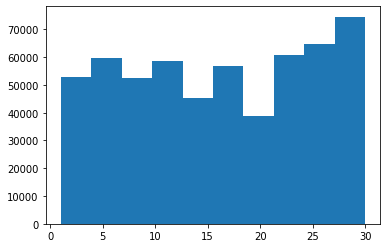


```python
#bins increase the number of bars in the graph
hist(data.dom, bins=30)
```


    (array([14546., 17474., 20701., 26714., 19521., 13445., 19550., 16188.,
            16843., 20041., 20420., 18170., 12112., 12674., 20641., 17717.,
            20973., 18074., 14602., 11017., 13162., 16975., 20346., 23352.,
            25095., 24925., 14677., 15475., 22835., 36251.]),
     array([ 1.        ,  1.96666667,  2.93333333,  3.9       ,  4.86666667,
             5.83333333,  6.8       ,  7.76666667,  8.73333333,  9.7       ,
            10.66666667, 11.63333333, 12.6       , 13.56666667, 14.53333333,
            15.5       , 16.46666667, 17.43333333, 18.4       , 19.36666667,
            20.33333333, 21.3       , 22.26666667, 23.23333333, 24.2       ,
            25.16666667, 26.13333333, 27.1       , 28.06666667, 29.03333333,
            30.        ]),
     <a list of 30 Patch objects>)


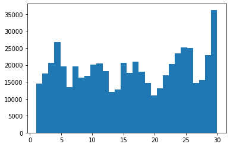


```python
#to distinguish between the various bars we reduce its width to 80%(0.8) of the original 
hist(data.dom, bins=30, rwidth=.8)
```


    (array([14546., 17474., 20701., 26714., 19521., 13445., 19550., 16188.,
            16843., 20041., 20420., 18170., 12112., 12674., 20641., 17717.,
            20973., 18074., 14602., 11017., 13162., 16975., 20346., 23352.,
            25095., 24925., 14677., 15475., 22835., 36251.]),
     array([ 1.        ,  1.96666667,  2.93333333,  3.9       ,  4.86666667,
             5.83333333,  6.8       ,  7.76666667,  8.73333333,  9.7       ,
            10.66666667, 11.63333333, 12.6       , 13.56666667, 14.53333333,
            15.5       , 16.46666667, 17.43333333, 18.4       , 19.36666667,
            20.33333333, 21.3       , 22.26666667, 23.23333333, 24.2       ,
            25.16666667, 26.13333333, 27.1       , 28.06666667, 29.03333333,
            30.        ]),
     <a list of 30 Patch objects>)


```python
#the bars dont correctly align on to the numbers
#thus we modify range for the graph to lie on top of the required intervals
#for better presentation
hist(data.dom, bins=31, rwidth=.8, range=(0.5,31.5))
```


    (array([14546., 17474., 20701., 26714., 19521., 13445., 19550., 16188.,
            16843., 20041., 20420., 18170., 12112., 12674., 20641., 17717.,
            20973., 18074., 14602., 11017., 13162., 16975., 20346., 23352.,
            25095., 24925., 14677., 15475., 22835., 36251.,     0.]),
     array([ 0.5,  1.5,  2.5,  3.5,  4.5,  5.5,  6.5,  7.5,  8.5,  9.5, 10.5,
            11.5, 12.5, 13.5, 14.5, 15.5, 16.5, 17.5, 18.5, 19.5, 20.5, 21.5,
            22.5, 23.5, 24.5, 25.5, 26.5, 27.5, 28.5, 29.5, 30.5, 31.5]),
     <a list of 31 Patch objects>)


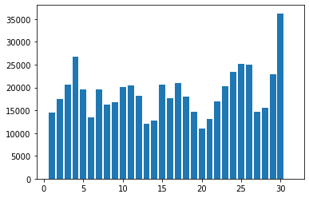


```python
#final touches
hist(data.dom, bins=31, rwidth=.8, range=(0.5,31.5))
xlabel('Date of Month')
ylabel('Frequency')
title('Frequency by DoM-Uber-APR2014')
```


    Text(0.5, 1.0, 'Frequency by DoM-Uber-APR2014')


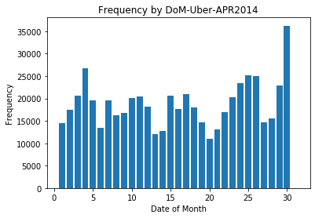


```python
#entries for different dates of month
for k, rows in data.groupby('dom'):
    print((k,len(rows)))
```

    (1, 14546)
    (2, 17474)
    (3, 20701)
    (4, 26714)
    (5, 19521)
    (6, 13445)
    (7, 19550)
    (8, 16188)
    (9, 16843)
    (10, 20041)
    (11, 20420)
    (12, 18170)
    (13, 12112)
    (14, 12674)
    (15, 20641)
    (16, 17717)
    (17, 20973)
    (18, 18074)
    (19, 14602)
    (20, 11017)
    (21, 13162)
    (22, 16975)
    (23, 20346)
    (24, 23352)
    (25, 25095)
    (26, 24925)
    (27, 14677)
    (28, 15475)
    (29, 22835)
    (30, 36251)
    


```python
#just for help
for k, rows in data.groupby('dom'):
    print(k,rows)
    break
#break is to stop the output at 1st day of the month
```

    1                  Date/Time      Lat      Lon    Base  dom  weekday  hour
    0      2014-04-01 00:11:00  40.7690 -73.9549  B02512    1        1     0
    1      2014-04-01 00:17:00  40.7267 -74.0345  B02512    1        1     0
    2      2014-04-01 00:21:00  40.7316 -73.9873  B02512    1        1     0
    3      2014-04-01 00:28:00  40.7588 -73.9776  B02512    1        1     0
    4      2014-04-01 00:33:00  40.7594 -73.9722  B02512    1        1     0
    ...                    ...      ...      ...     ...  ...      ...   ...
    554926 2014-04-01 23:21:00  40.7219 -73.9920  B02764    1        1    23
    554927 2014-04-01 23:25:00  40.7261 -74.0027  B02764    1        1    23
    554928 2014-04-01 23:38:00  40.7364 -73.9926  B02764    1        1    23
    554929 2014-04-01 23:41:00  40.7149 -73.9405  B02764    1        1    23
    554930 2014-04-01 23:46:00  40.7493 -73.9768  B02764    1        1    23
    
    [14546 rows x 7 columns]
    


```python
def count_rows(rows):
    return len(rows)

by_date = data.groupby('dom').apply(count_rows)
by_date
```


    dom
    1     14546
    2     17474
    3     20701
    4     26714
    5     19521
    6     13445
    7     19550
    8     16188
    9     16843
    10    20041
    11    20420
    12    18170
    13    12112
    14    12674
    15    20641
    16    17717
    17    20973
    18    18074
    19    14602
    20    11017
    21    13162
    22    16975
    23    20346
    24    23352
    25    25095
    26    24925
    27    14677
    28    15475
    29    22835
    30    36251
    dtype: int64


```python
plot(by_date)
```


    [<matplotlib.lines.Line2D at 0x29138f073c8>]


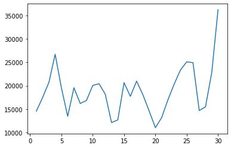


```python
bar(range(1,31),by_date)
#same as the histogram generated before
```


    <BarContainer object of 30 artists>


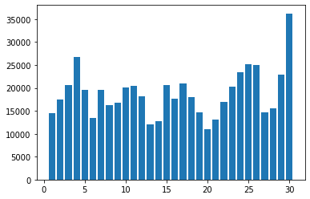


```python
#sorting
by_date_sorted = by_date.sort_values()
by_date_sorted
```


    dom
    20    11017
    13    12112
    14    12674
    21    13162
    6     13445
    1     14546
    19    14602
    27    14677
    28    15475
    8     16188
    9     16843
    22    16975
    2     17474
    16    17717
    18    18074
    12    18170
    5     19521
    7     19550
    10    20041
    23    20346
    11    20420
    15    20641
    3     20701
    17    20973
    29    22835
    24    23352
    26    24925
    25    25095
    4     26714
    30    36251
    dtype: int64


```python
bar(range(1,31),by_date_sorted)
```


    <BarContainer object of 30 artists>


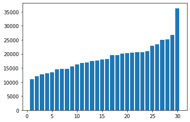


```python
#to fix the x-axis
bar(range(1,31),by_date_sorted)
xticks(range(1,31), by_date_sorted.index) #for sorting x-axis
#to remove unwanted text use ';'
; 
```


    ''


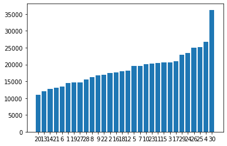


### Analyze the hour


```python
hist(data.hour, bins=24, rwidth=.8, range=(0.5,24.5))
```


    (array([ 7769.,  4935.,  5040.,  6095.,  9476., 18498., 24924., 22843.,
            17939., 17865., 18774., 19425., 22603., 27190., 35324., 42003.,
            45475., 43003., 38923., 36244., 36964., 30645., 20649.,     0.]),
     array([ 0.5,  1.5,  2.5,  3.5,  4.5,  5.5,  6.5,  7.5,  8.5,  9.5, 10.5,
            11.5, 12.5, 13.5, 14.5, 15.5, 16.5, 17.5, 18.5, 19.5, 20.5, 21.5,
            22.5, 23.5, 24.5]),
     <a list of 24 Patch objects>)


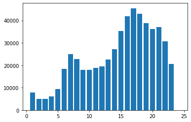


### Analyze the weekday


```python
hist(data.weekday, bins=7, range=(-.5,6.5), rwidth=.8, color='#f53d4f', alpha=.6)  #alpha is for opacity of the bars
xticks(range(7),'Mon Tue Wed Thu Fri Sat Sun'.split())
;
```


    ''


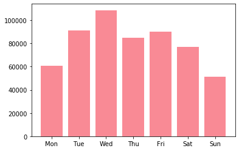


```python
count_rows(data)
```


    564516


```python
len(data)
```


    564516


### Cross Analysis (hour,dow)


```python
bt_h_d = data.groupby('weekday hour'.split()).apply(count_rows)
bt_h_d
```


    weekday  hour
    0        0        518
             1        261
             2        238
             3        571
             4       1021
                     ... 
    6        19      2579
             20      2276
             21      2310
             22      1639
             23      1018
    Length: 168, dtype: int64


```python
by_cross = bt_h_d.unstack()
by_cross
```


<div>
<style scoped>
    .dataframe tbody tr th:only-of-type {
        vertical-align: middle;
    }

    .dataframe tbody tr th {
        vertical-align: top;
    }

    .dataframe thead th {
        text-align: right;
    }
</style>
<table border="1" class="dataframe">
  <thead>
    <tr style="text-align: right;">
      <th>hour</th>
      <th>0</th>
      <th>1</th>
      <th>2</th>
      <th>3</th>
      <th>4</th>
      <th>5</th>
      <th>6</th>
      <th>7</th>
      <th>8</th>
      <th>9</th>
      <th>...</th>
      <th>14</th>
      <th>15</th>
      <th>16</th>
      <th>17</th>
      <th>18</th>
      <th>19</th>
      <th>20</th>
      <th>21</th>
      <th>22</th>
      <th>23</th>
    </tr>
    <tr>
      <th>weekday</th>
      <th></th>
      <th></th>
      <th></th>
      <th></th>
      <th></th>
      <th></th>
      <th></th>
      <th></th>
      <th></th>
      <th></th>
      <th></th>
      <th></th>
      <th></th>
      <th></th>
      <th></th>
      <th></th>
      <th></th>
      <th></th>
      <th></th>
      <th></th>
      <th></th>
    </tr>
  </thead>
  <tbody>
    <tr>
      <th>0</th>
      <td>518</td>
      <td>261</td>
      <td>238</td>
      <td>571</td>
      <td>1021</td>
      <td>1619</td>
      <td>2974</td>
      <td>3888</td>
      <td>3138</td>
      <td>2211</td>
      <td>...</td>
      <td>3117</td>
      <td>3818</td>
      <td>4962</td>
      <td>5574</td>
      <td>4725</td>
      <td>4386</td>
      <td>3573</td>
      <td>3079</td>
      <td>1976</td>
      <td>1091</td>
    </tr>
    <tr>
      <th>1</th>
      <td>765</td>
      <td>367</td>
      <td>304</td>
      <td>516</td>
      <td>887</td>
      <td>1734</td>
      <td>3766</td>
      <td>5304</td>
      <td>4594</td>
      <td>2962</td>
      <td>...</td>
      <td>4489</td>
      <td>6042</td>
      <td>7521</td>
      <td>8297</td>
      <td>7089</td>
      <td>6459</td>
      <td>6310</td>
      <td>5993</td>
      <td>3614</td>
      <td>1948</td>
    </tr>
    <tr>
      <th>2</th>
      <td>899</td>
      <td>507</td>
      <td>371</td>
      <td>585</td>
      <td>1003</td>
      <td>1990</td>
      <td>4230</td>
      <td>5647</td>
      <td>5242</td>
      <td>3846</td>
      <td>...</td>
      <td>5438</td>
      <td>7071</td>
      <td>8213</td>
      <td>9151</td>
      <td>8334</td>
      <td>7794</td>
      <td>7783</td>
      <td>6921</td>
      <td>4845</td>
      <td>2571</td>
    </tr>
    <tr>
      <th>3</th>
      <td>792</td>
      <td>459</td>
      <td>342</td>
      <td>567</td>
      <td>861</td>
      <td>1454</td>
      <td>3179</td>
      <td>4159</td>
      <td>3616</td>
      <td>2654</td>
      <td>...</td>
      <td>4083</td>
      <td>5182</td>
      <td>6149</td>
      <td>6951</td>
      <td>6637</td>
      <td>5929</td>
      <td>6345</td>
      <td>6585</td>
      <td>5370</td>
      <td>2909</td>
    </tr>
    <tr>
      <th>4</th>
      <td>1367</td>
      <td>760</td>
      <td>513</td>
      <td>736</td>
      <td>932</td>
      <td>1382</td>
      <td>2836</td>
      <td>3943</td>
      <td>3648</td>
      <td>2732</td>
      <td>...</td>
      <td>4087</td>
      <td>5354</td>
      <td>6259</td>
      <td>6790</td>
      <td>7258</td>
      <td>6247</td>
      <td>5165</td>
      <td>6265</td>
      <td>6708</td>
      <td>5393</td>
    </tr>
    <tr>
      <th>5</th>
      <td>3027</td>
      <td>2479</td>
      <td>1577</td>
      <td>1013</td>
      <td>706</td>
      <td>704</td>
      <td>844</td>
      <td>1110</td>
      <td>1372</td>
      <td>1764</td>
      <td>...</td>
      <td>3042</td>
      <td>4457</td>
      <td>5410</td>
      <td>5558</td>
      <td>6165</td>
      <td>5529</td>
      <td>4792</td>
      <td>5811</td>
      <td>6493</td>
      <td>5719</td>
    </tr>
    <tr>
      <th>6</th>
      <td>4542</td>
      <td>2936</td>
      <td>1590</td>
      <td>1052</td>
      <td>685</td>
      <td>593</td>
      <td>669</td>
      <td>873</td>
      <td>1233</td>
      <td>1770</td>
      <td>...</td>
      <td>2934</td>
      <td>3400</td>
      <td>3489</td>
      <td>3154</td>
      <td>2795</td>
      <td>2579</td>
      <td>2276</td>
      <td>2310</td>
      <td>1639</td>
      <td>1018</td>
    </tr>
  </tbody>
</table>
<p>7 rows × 24 columns</p>
</div>


```python
seaborn.heatmap(by_cross)
```


    <matplotlib.axes._subplots.AxesSubplot at 0x2913bb64788>


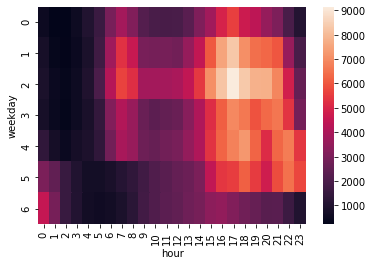


### BY Lat and Lon


```python
hist(data['Lat'], bins=100, range=(40.5,41))
;
```


    ''


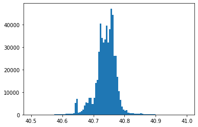


```python
hist(data['Lon'],bins=100,range=(-74.1,-73.9))
;
```


    ''


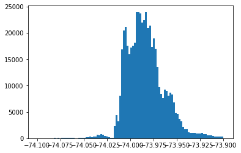


```python
hist(data['Lat'], bins=100, range=(40.5,41))
hist(data['Lon'],bins=100,range=(-74.1,-73.9))
;
```


    ''


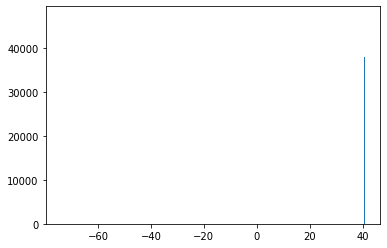


```python
hist(data['Lat'], bins=100, range=(40.5,41), color='g', alpha=.5, label = 'latitude')
#grid() #for grid lines
legend(loc='upper left')
twiny() #for upper and lower x-axis
hist(data['Lon'],bins=100, range=(-74.1,-73.9), color='r', alpha=.5, label = 'longitude')
#grid()
legend(loc='best')
;
```


    ''


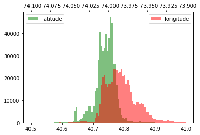


```python
plot(data['Lat'])
```


    [<matplotlib.lines.Line2D at 0x2913e4a0588>]


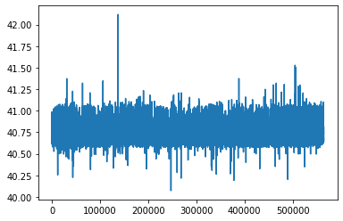


```python
plot(data['Lat'] ,'.', ms=10, color='red', label='lat')
xlim(0,100) #sets the x-axis limits
```


    (0, 100)


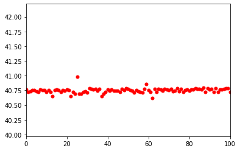


```python
figure(figsize=(20,20))
plot(data['Lon'], data['Lat'] ,'.', ms=1, color='red', label='lat')
xlim(-74.2,-73.7)
ylim(40.6,41)
grid()
```


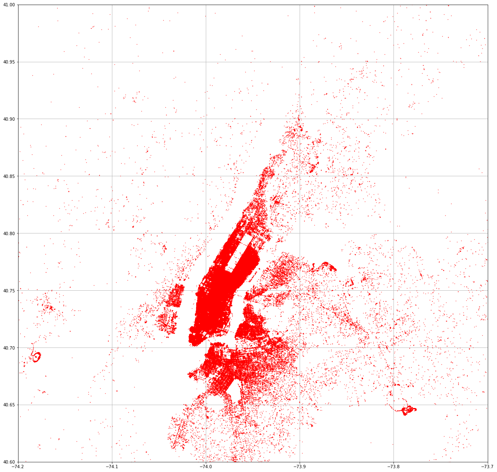


```python

```
